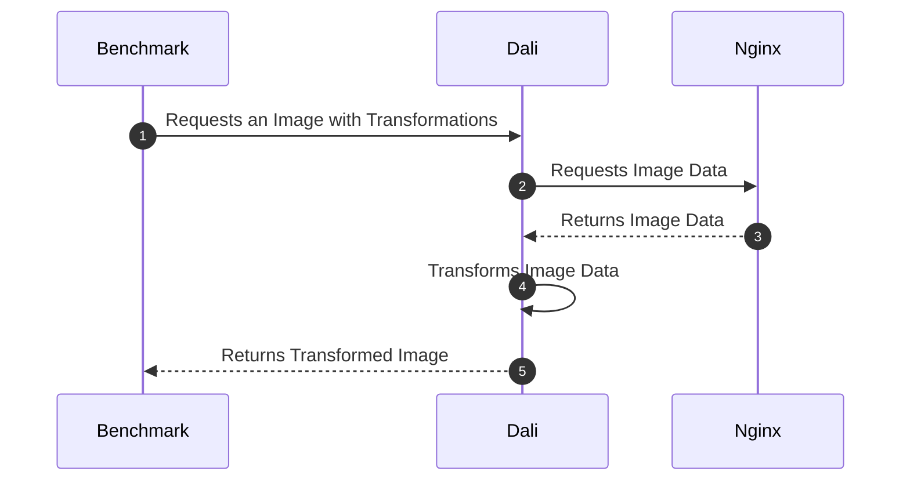

# BENCHMARKING

The criterion framework was chosen as the benchmarking suite.

Install the `criterion` helper crate.

```console
cargo install cargo-criterion
```

## Layout

The `./benches` folder is the default location of where the benchmark files will be searched. For each file in thei directory, a corresponding entry needs to be made in the `Cargo.toml` file.

```toml
[[bench]]
name = "request_benchmarks"
harness = false
```

## Performing a benchmark

The dali server has two implementations of an http server to receive, request, transform and return the request.



To run the test, you will need to have a web server (Nginx) to serve the requested images and the compiled Dali server running that the Benchmark test can perform its benchmark against. 

A helper script, `./scripts/dali-bench.sh` was developed to ease this.

The script takes the following parameters:

1. The name of the benchmark to run as specified in the `Cargo.toml` definition, i.e. without the`.rs` extension.
2. Optionally, it takes the name of the feature that the test must use. Possible choices are:
    * _**hyper_client**_ - this is the choice if no parameter is given to the script
    * _**awc_client**_ - the replacement http server that is under development

If you are on a mac, then the test run will be opened in your default browser after the run.

How will we save and compare runs between the features and new code changes? We use the [baselines](https://bheisler.github.io/criterion.rs/book/user_guide/command_line_options.html#baselines) functionality that is pass-throughed to criterion from the bench command with `--` as a parameter separator.

Future ideas...

```console
git checkout master
./scripts/dali-bench.sh request_benchmarks hyper_client --save
./scripts/dali-bench.sh request_benchmarks awc_client --save
git checkout your_new_code_branch
./scripts/dali-bench.sh request_benchmarks hyper_client --save
./scripts/dali-bench.sh request_benchmarks awc_client --save

# Some optimization work here

# Measure again
cargo bench
# Now compare against the stored baselines without overwriting it or re-running the measurements
cargo bench -- --load-baseline new --baseline master
cargo bench -- --load-baseline new --baseline feature
```

